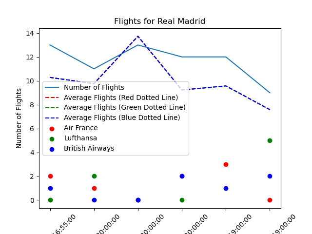

# Analysis of effects Soccer matches on the inflow of flights to the match location

Authors:
- **Vamsi Krishna Kunapareddy**, **vkunapar@buffalo.edu**
- **Vikas Dadadalli Kumar**, **vikasdad@buffalo.edu**
- **Karthikeyan Saravanan**, **ksaravan@buffalo.edu**
- **Hemanth Ramineni Damodhar**, **hraminen@buffalo.edu**

YouTube Video:  [link]( https://youtu.be/bAstPYItXYk)


## Task List

| ID | Task Description | Due Date | Responsible | Status | Comments |
| --- | --- | --- | --- | --- | --- |
| 1 | Find the Soccer and Flight data | 2023-05-02 | Vikas & Hemanth | COMPLETED | Finalised rapid-API |
| 2 | Clearly check for the required end points in the API's| 2023-05-03 | Vamsi & Karthikeyan | COMPLETED | Since all API's might not contain required end points a deep seearch into the API was required|
| 3 | Evaluate the biggest league based on the number of teams playing and extract required data| 2023-05-04 | Vikas & Hemanth | COMPLETED | Based on number of matches UEFA Champions League is finalised |
| 4 | Extract the fixture details of UEFA league in season 2020-21 in a data frame| 2023-05-05 | Vamsi & Karthikeyan | COMPLETED | 
| 5 | Merge airport details(ICAO code, size and average flights) of the teams' cities into fixture details dataframe| 2023-05-06 | Vikas & Hemanth | COMPLETED |
| 6 | For a particular home team find the change in number of flights for different away teams | 2023-05-07 | Vamsi & Karthikeyan | COMPLETED |
| 7 | Upload README.md document to Github| 2023-05-08 | Vamsi | COMPLETED |
| 8 | Determine which away teams' number of inbound flights are higher| 2023-05-09 | Vikas & Hemanth | COMPLETED |
| 9 | Taking only two teams determine which place has more foreign attendees| 2023-05-09 | Vamsi & Karthikeyan | COMPLETED |
| 10 | Merge airline details that operate from an airport to the original data frame | 2023-05-10 | Vikas & Hemanth | COMPLETED |
| 11 | Plot the number of inbound flights of different airlines with time on X- axis  | 2023-05-11 | Vamsi & Karthikeyan | COMPLETED |
| 12 |  Upload README.md document to Github  | 2023-05-12 | Vamsi | COMPLETED |
| 13 |  Plot the delay of airlines on match day and compare with average delay of the airport | 2023-05-13 | Vikas & Hemanth | COMPLETED |
| 14 |  Add match attendance and inbound flyers columns to the original data frame and loosely determine percentage of foreign attendees| 2023-05-14 | Vamsi & Karthikeyan | COMPLETED |
| 15 |  Geo spatially plot the  number of inbound flights from away team city  with animation | 2023-05-15 | Vikas & Hemanth | COMPLETED | 
| 16 | Complete YouTube video and upload to YouTube | 2023-05-16 | Vamsi | COMPLETED |
| 17 | Upload README.md document to Github | 2023-05-17 | Vamsi | COMPLETED|

--- 

## Introduction
*Considering that flight delay is most studied field in Airline operations and that Soccer is a sport watched by millions of people not only on Television but also visiting the stadium, the effects of the sport on average delay and surge of the demand to book tickets seemed really interesting*

- *We are using soccer data from Rapid API(link in references) which contains interesting end points such as leagues,fixtures, venues and many more!*
- *Flight API with various end points such as airport, airlines, flight information are used to conduct the proposed analysis*
- *It is common observation that influx of people to a city is more due to a soccer match. Here, we try to quantitatively determine the change in the traffic of flights due to soccer match, which can be used by 
local municipalities to administer and manage the event better. This is done by visualising time on X- axis and the number of flights on Y-axis*
- *One might wondrer which is the bettter place (interms of influx of people) when a match happened between two teams, and the result might help taking many inferences such as the interest level of fans,
air transport network or even economy of a country. This is done by taking two teams's matches(one in home and another in away) and comparing the inbound number of flights*
- *Compare the airlines visually to determine which airlines have maximum change in the traffic due to a soccer match*
- *Visualize the change of average delay of the flights due to soccer match and determine which airline has the least or the highest delay*


---

## References

- 970+ football leagues & cups. Live score (updated every 15s), live & pre-match odds, events, line-ups, coaches, players, top scorers, standings, statistics, transfers, predictions
    (https://www.api-football.com/documentation-v3)
-  Flight data API for travel, hospitality, or aviation applications, researchers, small teams, and individual developers.(https://rapidapi.com/aedbx-aedbx/api/aerodatabox)


## Requirements

- *Install pandas and numpy using pip install method. Follow the link for more info https://phoenixnap.com/kb/install-numpy*
- *Sign up in https://rapidapi.com/hub and find API key in your profile and paste this key in the RAPID KEY variable provided in the code*


---


## Explanation of the Code

The code, `IE555_vkunapar_project.ipynb`, begins by importing necessary Python packages:
```

import matplotlib.pyplot as plt
import http.client
import json
import pandas as pd
import numpy as np
import random
import matplotlib.pyplot as plt
import seaborn as sns
import ipywidgets as widgets
from IPython.display import display, IFrame
import folium
import webbrowser
```

- *NOTE: Run the following commands if the libraries are not in the system*
 ```
 !pip install folium
 !pip install ipywidgets
 
 ```

We then import data from [api-football-v1.p.rapidapi.com]. 
```
# Enter your rapidapi key here:
RAPIDAPIKEY = '3ee19aa166msh3261b83509f104dp118820jsn77f7b75db061'    # <-- FIXME.  Enter your key here.

# We'll use this variable in several places below.

# NOTE:  Here's how I like to store/use passwords for shared notebooks:
#'''
# import os
# RAPIDAPIKEY = os.environ['3ee19aa166msh3261b83509f104dp118820jsn77f7b75db061']
#''';
# Visit https://veroviz.org/documentation.html#installation for instructions.

```

```
# Now, we'll use the "countries" endpoint to get a list of countries:
conn.request("GET", "/countries", headers=headers)

resp  = conn.getresponse()
data = resp.read().decode("utf-8")

# `data` is a string, in the JSON (JavaScript Object Notation) format
print(type(data))
print(data)
# Note how `data` looks like a dictionary (but it's a string)

# Let's create a dictionary from this JSON data:
countries = json.loads(data)

```
After importing data from the API applying lambda function to extract the required details from the dictionary
```
fixture_lea_df = pd.DataFrame(fixtures_lea['response'])
df = fixture_lea_df
# extract the required columns
df = df[['fixture', 'league', 'teams']]
df['date'] = df['fixture'].apply(lambda x: x['date'])
df['city'] = df['fixture'].apply(lambda x: x['venue']['city'])
df['timezone'] = df['fixture'].apply(lambda x: x['timezone'])
df['league_name'] = df['league'].apply(lambda x: x['name'])
df['home_team'] = df['teams'].apply(lambda x: x['home']['name'])
df['home_id'] = df['teams'].apply(lambda x: x['home']['id'])
df['away_team'] = df['teams'].apply(lambda x: x['away']['name'])
df['away_id'] = df['teams'].apply(lambda x: x['away']['id'])
df

```
Another API for the flight and Airport data is used to dynamically import the necessary data

```

# In this cell we'll establish a connection for this particular API:
conn = http.client.HTTPSConnection("flight-radar1.p.rapidapi.com")

headers = {
    'X-RapidAPI-Key': "3ee19aa166msh3261b83509f104dp118820jsn77f7b75db061",
    'X-RapidAPI-Host': "flight-radar1.p.rapidapi.com"
}
```
```
# Now, we'll use the "countries" endpoint to get a list of countries:
conn.request("GET", "/airports/list", headers=headers)

resp  = conn.getresponse()
data = resp.read().decode("utf-8")

# `data` is a string, in the JSON (JavaScript Object Notation) format
print(type(data))
print(data)
# Note how `data` looks like a dictionary (but it's a string)

# Let's create a dictionary from this JSON data:
airports = json.loads(data)
```

Cities of the home and away cities might not contain an airport. Hence thefollowing code finds largest airport in the country and assumed to be the Airpor for that City
```
# Find the biggest airport in each country
biggest_airport = airport_df.groupby('country')['size'].idxmax().to_dict()

# Add the new columns to the final_df DataFrame
final_df['iata_h'] = ''
final_df['iata_a'] = ''
final_df['icao_h'] = ''
final_df['icao_a'] = ''
final_df['airport_city_h'] = ''
final_df['airport_city_a'] = ''

# Loop over the rows of the sh DataFrame
for i, row in final_df.iterrows():
    # Check if home_team_city is present in airport_df
    if row['home_team_city'] in airport_df['city'].values:
        airport = airport_df.loc[airport_df['city'] == row['home_team_city']]
        final_df.at[i, 'iata_h'] = airport['iata'].values[0]
        final_df.at[i, 'icao_h'] = airport['icao'].values[0]
        final_df.at[i, 'airport_city_h'] = airport['city'].values[0]
    else:
        # Find the biggest airport in the home_team_country
        country = row['home_team_country']
        if country in biggest_airport:
            airport_index = biggest_airport[country]
            airport = airport_df.loc[airport_index]
            final_df.at[i, 'iata_h'] = airport['iata']
            final_df.at[i, 'icao_h'] = airport['icao']
            final_df.at[i, 'airport_city_h'] = airport['city']

    # Check if away_team_city is present in airport_df
    if row['away_team_city'] in airport_df['city'].values:
        airport = airport_df.loc[airport_df['city'] == row['away_team_city']]
        final_df.at[i, 'iata_a'] = airport['iata'].values[0]
        final_df.at[i, 'icao_a'] = airport['icao'].values[0]
        final_df.at[i, 'airport_city_a'] = airport['city'].values[0]
    else:
        # Find the biggest airport in the away_team_country
        country = row['away_team_country']
        if country in biggest_airport:
            airport_index = biggest_airport[country]
            airport = airport_df.loc[airport_index]
            final_df.at[i, 'iata_a'] = airport['iata']
            final_df.at[i, 'icao_a'] = airport['icao']
            final_df.at[i, 'airport_city_a'] = airport['city']
final_df
```
To plot these points on a map we are adding latitude and longitude to each city(from home team and away team)
```
#adding latitude and lon to final_df
# Check if iata_h is in airport_df and populate lat_h and lon_h
final_df['lat_h'] = final_df['iata_h'].map(airport_df.set_index('iata')['lat'])
final_df['lon_h'] = final_df['iata_h'].map(airport_df.set_index('iata')['lon'])

# Check if iata_a is in airport_df and populate lat_a and lon_a
final_df['lat_a'] = final_df['iata_a'].map(airport_df.set_index('iata')['lat'])
final_df['lon_a'] = final_df['iata_a'].map(airport_df.set_index('iata')['lon'])

# Remove rows with missing iata_h or iata_a values
final_df = final_df.dropna(subset=['iata_h', 'iata_a'])
final_df
```


Here we could not find any free online sources that provide the necessary data required to proceed further.
Hence using the data provided by an employee through his enterprise key.
The data provided by the source is merged to the soccer data frame processed above.
 User is required to download the csv file provided to proceed further.

Download the file provided in the repository to proceed further
```
# Read the CSV file into a DataFrame
final_df = pd.read_csv('Merged_data.csv')

# Do something with the DataFrame
# For example, you can print the first few rows
final_df

```

The following code displays number of flights between the away and home countries on the match day flew and the average number flights scheduled by the airlines.
```
import random
import matplotlib.pyplot as plt

# Randomly select a home_team
selected_home_team = random.choice(final_df['home_team'].unique())

# Filter the DataFrame for the selected home_team
selected_rows = final_df[final_df['home_team'] == selected_home_team]

# Extract the relevant data
date_time = selected_rows['date_time']
number_of_flights = selected_rows['number_of_flights']
away_teams = selected_rows['away_team']
average_flights = selected_rows['Average_flights']

# Define custom colors for points and dotted lines
point_colors = ['red', 'blue', 'green']
line_colors = ['darkred', 'darkblue', 'darkgreen']

# Create the plot
plt.figure(figsize=(10, 6))
for i, away_team in enumerate(away_teams.unique()):
    # Filter data for the current away_team
    team_rows = selected_rows[selected_rows['away_team'] == away_team]

    # Plot number_of_flights as points with different colors for each away_team
    plt.scatter(date_time[team_rows.index], number_of_flights[team_rows.index], c=point_colors[i], label=away_team)

for i, avg_flight in enumerate(average_flights):
    # Plot Average_flights as dotted lines with different colors for each average_flight
    plt.axhline(avg_flight, linestyle='dotted', color=line_colors[i])

# Customize the plot
plt.xlabel('Date and Time')
plt.ylabel('Number of Flights')
plt.title(f'Flight Data for Home Team: {selected_home_team}')
plt.legend()
plt.xticks(rotation=45)
plt.grid(True)

plt.savefig('Graph 1.png')	

# Show the plot
plt.show()
```

The output from this code is shown below:


This following code shows the correlation between the Average number of flights between those cities and number of flights during the match
```
# Compute the correlation matrix
correlation_matrix = final_df[['Average_flights','number_of_flights']].corr()

print(correlation_matrix)
```

The output from the remaining similar codes are shown below:

- 
- 
- 
- 

The following code allows user to chose his home team(city) to find out location of matches and number of flights departed on the match day
```
import ipywidgets as widgets
from IPython.display import display, IFrame
import folium
import webbrowser

# Create a dropdown widget to choose the away team
away_team_dropdown = widgets.Dropdown(
    options=final_df['away_team'].unique(),
    description='Choose your team:',
    disabled=False
)

# Function to handle dropdown value change and update the map
def on_dropdown_change(change):
    away_team = change['new']
    filtered_df = final_df[final_df['away_team'] == away_team]

    # Calculate the center coordinates
    center_lat = filtered_df[['lat_h', 'lat_a']].mean().mean()
    center_lon = filtered_df[['lon_h', 'lon_a']].mean().mean()

    # Create the map
    map_widget = folium.Map(location=[center_lat, center_lon], zoom_start=4)

    # Add markers for home and away airports
    for _, row in filtered_df.iterrows():
        home_marker = folium.Marker(location=(row['lat_h'], row['lon_h']), draggable=False, tooltip=row['airport_city_h'], icon=folium.Icon(color='yellow'))
        away_marker = folium.Marker(location=(row['lat_a'], row['lon_a']), draggable=False, tooltip=row['airport_city_a'], icon=folium.Icon(color='green'))
        home_marker.add_to(map_widget)
        away_marker.add_to(map_widget)

        # Draw line between home and away markers
        line = folium.PolyLine(locations=[(row['lat_h'], row['lon_h']), (row['lat_a'], row['lon_a'])], color='blue',
                              tooltip=f"Flights: {row['number_of_flights']}, Date: {row['date_time']}")
        line.add_to(map_widget)

    # Save the map as an HTML file
    map_file = f"map_{away_team}.html"
    map_widget.save(map_file)
    print(f"Map saved as {map_file}")

    # Open the HTML file in a new window
    webbrowser.open_new_tab(map_file)

# Register the dropdown widget's value change event
away_team_dropdown.observe(on_dropdown_change, names='value')

# Display the dropdown widget
display(away_team_dropdown)
```
This following code consolidates geographical map that displays match locations, number of matches held, flight routes between the match locations.
When run, the following code saves a HTML file to the directory from where this file is being run.
```
import folium
from folium import plugins

# Create a map centered on Europe
m = folium.Map(location=[50, 10], zoom_start=4)

# Create a feature group for airports
airports_fg = folium.FeatureGroup(name='Airports')

# Add airport markers to the feature group
for index, row in final_df.iterrows():
    # Airport departure location
    departure_lat = row['lat_h']
    departure_lon = row['lon_h']
    departure_iata = row['iata_h']
    
    # Airport arrival location
    arrival_lat = row['lat_a']
    arrival_lon = row['lon_a']
    arrival_iata = row['iata_a']
    
    # Create markers for departure and arrival airports
    departure_marker = folium.Marker(location=[departure_lat, departure_lon], popup=departure_iata)
    arrival_marker = folium.Marker(location=[arrival_lat, arrival_lon], popup=arrival_iata)
    
    # Add markers to the feature group
    airports_fg.add_child(departure_marker)
    airports_fg.add_child(arrival_marker)

# Add the airports feature group to the map
m.add_child(airports_fg)

# Create a feature group for flights
flights_fg = folium.FeatureGroup(name='Flights')

# Add flight lines to the feature group
for index, row in final_df.iterrows():
    # Airport departure location
    departure_lat = row['lat_h']
    departure_lon = row['lon_h']
    
    # Airport arrival location
    arrival_lat = row['lat_a']
    arrival_lon = row['lon_a']
    
    # Number of flights between airports
    num_flights = row['number_of_flights']
    
    # Create a line between departure and arrival airports
    line = folium.PolyLine(locations=[(departure_lat, departure_lon), (arrival_lat, arrival_lon)], 
                           color='blue', weight=num_flights/10)
    
    # Add line to the feature group
    flights_fg.add_child(line)

# Add the flights feature group to the map
m.add_child(flights_fg)

# Create a feature group for match cities
cities_fg = folium.FeatureGroup(name='Match Cities')

# Add match cities as circle markers with varying color intensity based on the number of matches
for city, count in final_df['city'].value_counts().iteritems():
    # Get the latitude and longitude of the city
    city_lat = final_df[final_df['city'] == city].iloc[0]['lat_h']
    city_lon = final_df[final_df['city'] == city].iloc[0]['lon_h']
    
    # Create a circle marker with color intensity based on the number of matches
    circle_marker = folium.CircleMarker(location=[city_lat, city_lon], radius=10, 
                                        popup=f'{city}: {count} matches', fill=True, 
                                        fill_color='red', fill_opacity=count/10, color='black')
    
    # Add circle marker to the feature group
    cities_fg.add_child(circle_marker)

# Add the match cities feature group to the map
m.add_child(cities_fg)

# Add layer control to the map
folium.LayerControl().add_to(m)

# Save the map as an HTML file
m.save('map_soccer_matches_airline_routes.html')


```
---

## How to Run the Code

1. Ensure that you have registered for the [https://rapidapi.com/hub] API key.

2. Ensure that you have installed necessary Python packages shown above. If any import error presides, use pip install method to download the package

3. Open Anaconda prompt window.

2. Change directories to where `IE555_vkunapar_project.ipynb` is saved.

3. Type the following command:
	```
	jupyter notebook
	```
4. From the jupyter notebook select the file with the above file name

---

## Results from your Analysis

- <br />
We can see average daily flights as dotted lines and number of flights between  a random home team and the away teams as dots. For most of the matches
number of flights is higher than average. This shows there is a correlation between the match days and flight inflow to a city
- <br />
For different Airlines on different match days the effect of matches on Airline flights can be seen. Here visually any correaltion could not be found
- <br />
The correlation for all the match days between average daily flights and the number of flights is shown
- <br />
In this bar graph we can see that Buducnost podgorica is the team to whom the number of flights is the highest
- <br />
A visually pleasing geographical map of where matchse are held and the flights between thise cities and match dates and number of flights
- <br />
We can see a high correlation betweeen Average daily flights and Number of flights during the match day as is apparent from the above correlation matrix


